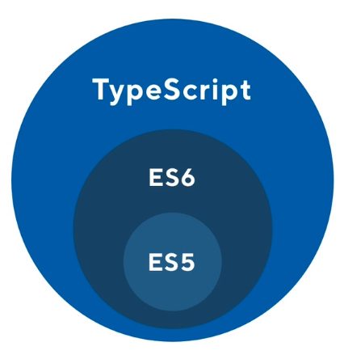

# General Notes

## Intro

1. TypeScript does not run in the Browser. So a compilation step in the build process is need.

2. Technically it is possible using tools but not recommended in production.

3. When using TS with Angular/React, the TS is compiled to JS during the buld process into one big JS file (a bundle).

4. Which may Ocassionally pull in other bundles lazily.

## Typescript Compiler

1. We need a typescript compiler to convert the ts to js.

2. The compiler can decide what version of js to compilet to ES5/6/7

3. 

4. We can use the typescript compiler outside of webpact. By having it installed globally.

   ```bash
   npm i -g typescript
   yarn add global typescript
   ```

5. Can also use it locally by having it as a dependancy in our projects

## Installing TS Compilers

1. In the package.json file there is a `start script which calls our webpack-dev-server`

2. We need to setup this webpack dev server, most modern libraries/frameworks has tools to take care of this tep for us

3. For example with create-react-app we add the typescript options while creating the project etc

4. As seen in the `package.json file` we need the following dev dependecies and start script

   ```json
   {
     "scripts": {
       "start": "webpack-dev-server",
       "test": "echo \"Error: no test specified\" && exit 1"
     },
     "devDependencies": {
       "awesome-typescript-loader": "3.4.1",
       "typescript": "2.6.2",
       "webpack": "3.10.0",
       "webpack-dev-server": "2.9.7"
     }
   }
   ```

## TypeScript Compiler (tsc) and tsconfig

## Setting up Webpack for TypeScript

## Resources
