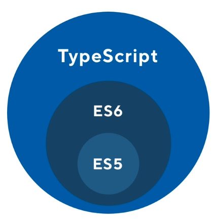

# TS Under the Hood

This section talks about how ts works and how to set it up.

## Contents

<!-- toc -->

- [TS Under the Hood](#ts-under-the-hood)
  - [Contents](#contents)
  - [Intro](#intro)
  - [Typescript Compiler](#typescript-compiler)
  - [Installing TS Compilers](#installing-ts-compilers)
  - [TypeScript Compiler (tsc) and tsconfig](#typescript-compiler-tsc-and-tsconfig)
  - [Setting up Webpack for TypeScript](#setting-up-webpack-for-typescript)
  - [Setting up TS for Node.js](#setting-up-ts-for-nodejs)

<!-- tocstop -->

## Intro

1. TypeScript does not run in the Browser. So a compilation step in the build process is need.

2. Technically it is possible using tools but not recommended in production.

3. When using TS with Angular/React, the TS is compiled to JS during the buld process into one big JS file (a bundle).

4. Which may Ocassionally pull in other bundles lazily.

## Typescript Compiler

1. We need a typescript compiler to convert the ts to js.

2. The compiler can decide what version of js to compilet to ES5/6/7

3. 

4. We can use the typescript compiler outside of webpact. By having it installed globally.

   ```bash
   npm i -g typescript
   yarn add global typescript
   ```

5. Can also use it locally by having it as a dependancy in our projects

## Installing TS Compilers

1. In the package.json file there is a `start script which calls our webpack-dev-server`

2. We need to setup this webpack dev server, most modern libraries/frameworks has tools to take care of this tep for us

3. For example with create-react-app we add the typescript options while creating the project etc

4. As seen in the `package.json file` we need the following dev dependecies and start script

   ```json
   {
     "scripts": {
       "start": "webpack-dev-server",
       "test": "echo \"Error: no test specified\" && exit 1"
     },
     "devDependencies": {
       "awesome-typescript-loader": "3.4.1",
       "typescript": "2.6.2",
       "webpack": "3.10.0",
       "webpack-dev-server": "2.9.7"
     }
   }
   ```

## TypeScript Compiler (tsc) and tsconfig

1. Running the TS compiler from terminal

   ```bash
   # tsc is the command line tool to deal with TS, its has a cli

   # will bring up the help menu with examples and options
   tsc
   # version
   tsc -version
   # running a single file
   tsc hello.ts

   ```

2. Initializing a TS project

   ```bash
   # initialing a ts project and generating the tsconfig file
   # The file will have most stuff commented out
   # but u can always generate this and see possible configurations
   tsc --init
   ```

3. Once we have the tscongif file we can just run `tsc` on command line and project will be built and js files will be produced

4. but our initial html has the script as follows (see below), so we need to generate our js files inside a `/dist` directory

   ```html
   <script src="dist/app.js"></script>
   ```

5. To specify an output directory named dist we run the following

   ```bash
   tsc --outDir dist
   ```

6. But instead of having to do that manually we simply update our tsconfig file by adding, now we can once again just run `tsc` to build it

   ```json
   {
     "compilerOptions"{
     <!-- other properties -->
     "outDir": "dist"
     }
   }
   ```

7. Finally we want to enable watch mode, so the js files are auto updated when we change our ts files. To do so run the following and your terminal will now be running the tsc cli tool which will notify you of updates.

```bash
# running tsc with the watch option
tsc -watch
```

## Setting up Webpack for TypeScript

1. It's a good idea to have a local server where we can live reload our TS web apps

2. This is where Webpack dev server comes in

3. For the course we use webpack (via a webpack configuration files) to

   1. take care of compiling the TS
   2. setting up local dev server
   3. keep an eye on the changes

4. He talks about how webpack works for the first 5 min of the video (A Good Refresher), and the different parts of the `webpack.config.js` file

5. The output of webpack is completely virtual, there's no physical `/dist` folder. So we can delete it.

6. We no longer need the `/dist` folder with webpack like we did when we run tsc directly

7. In the `index.html` file we can now change the scipt tag as follows

   ```html
   <!-- <script src="dist/app.js"></script> -->
   <script src="app.js"></script>
   ```

8. These are some advantages of using Webpack over the ts compiler directly

9. Also now we run our start script and start our webpack dev server, we also see some meta data like size (of app), chunks (useful for doe splitting)

10. I believe we still need our tsconfig.json file.

11. We don't need the `outDir` property for webpack but good idea to keep it none the less if we need to use tsc directly again. (I checked this, works as expected)

## Setting up TS for Node.js

We will get typescript, and the TS type definitions for node itself

Additionally we will also need the program `ts-node` to the grunt work and run our files.

We will use it in the start script

```bash
yarn add -D @types/node typescript ts-node
```

```json
{
  "scripts": {
    "start": "tsc-node src/index.ts"
  }
}
```

While that is easy, ts-node is pretty slow and not actually used in production. (So will probably not have that as my start `script` in the future)

So I have an alternate `watch` script as follows.

Finally we can run just run the index.js file created in dist folder using node or nodemon in a different terminal

So we can change our `start` script and add a `dev` script as well

If you want you could also use `nodemon` with wit `ts-node` as in the script `dev2`

```json
{
  "scripts": {
    "watch": "tsc -watch",
    "start": "node dist/index.js",
    "dev": "nodemon dist/index.js",
    "dev2": "nodemon --exec ts-node src/index.ts"
  }
}
```
